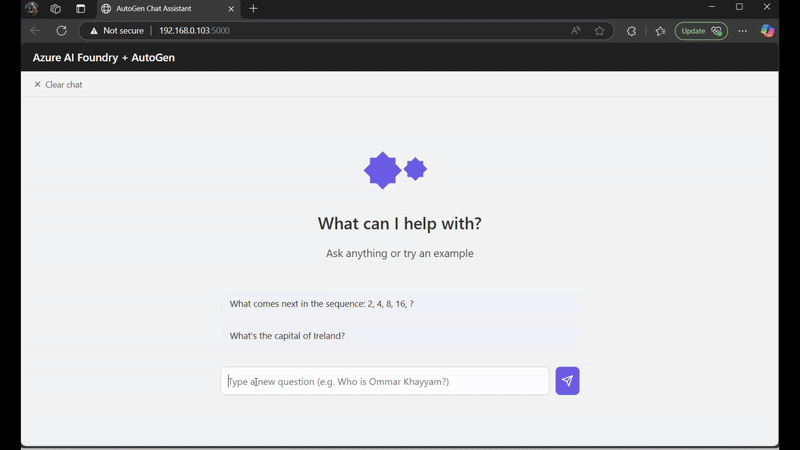

# 🤖 Chatbot with UI Project

This repository contains the code for a chatbot application featuring a user interface, powered by AutoGen and a Flask backend.



**Key Features Demonstrated:**

-   **Interactive Chat Interface:** Simple web UI built with HTML, CSS, and vanilla JavaScript (`front-end/chat_bot.html`).
-   **AutoGen Integration:** Utilizes `autogen-agentchat`'s `AssistantAgent` for chat logic (`subs/ai_agent.py`).
-   **Flask Backend:** A Python Flask server (`app.py`) handles API requests and serves the frontend.
-   **Multiple LLM Backend Support:** Configurable to use Azure OpenAI, OpenAI API, or GitHub Models (`subs/client_config.py`).
-   **Streaming Responses:** The backend streams the agent's response back to the UI for a more interactive feel.
-   **Basic Session Management:** Uses a simple session ID generated on the client-side for context (though history clearing is not fully implemented in the backend provided).

**Goal:** To provide a simple, functional example of connecting a web-based user interface to an AutoGen agent via a Flask backend, allowing users to interact with different LLM providers.

**Scenario:** Describe a typical user interaction or flow within the application. For example:
A user opens the web application (`chat_bot.html`), types a message into the chat input, sends it via a JavaScript `fetch` request to the Flask `/chat` endpoint. The Flask app invokes the AutoGen `AssistantAgent`, streams the response back, and the JavaScript updates the chat history in the browser.

<!-- Optional: Add a screenshot or GIF of the UI in action -->
<!--  -->

## 📚 Libraries & Frameworks Used

-   **Frontend:** HTML, CSS, Vanilla JavaScript
-   **Backend:** Python, Flask, Flask-CORS
-   **Chatbot Logic:** AutoGen (`autogen-agentchat`, `autogen-core`, `autogen-ext`)
-   **Dependencies:**  Listed in `pyproject.toml`

## 🛠️ Setup

Follow these steps carefully to set up your environment:

1.  **Prerequisites**:
    -   Python >= 3.12 (as specified in `pyproject.toml`)
    -   Git

2.  **Clone the Repository**:
    ```bash
    git clone https://github.com/SaM-92/chatbot-with-ui.git
    cd chatbot_with_ui
    ```

3.  **Backend Setup & Dependencies**:
    ```bash
    # Create and activate virtual environment (recommended)
    python3.12 -m venv .venv
    # Activate (Linux/macOS)
    source .venv/bin/activate
    # Activate (Windows)
    .\.venv\Scripts\activate

    # Install project dependencies from pyproject.toml
    pip install -e .

    # Configure Environment Variables
    # 1. Copy the example environment file:
    #    On Linux/macOS: cp .env.example .env
    #    On Windows:     copy .env.example .env
    #
    # 2. Edit the new .env file:
    #    - Set the API_HOST variable to the provider you want to use ('azure', 'openai', or 'github').
    #    - Fill in the corresponding API keys, endpoints, model names, etc., for your chosen provider.
    #    - Ensure variables for unused providers are commented out or removed.
    ```
    *Note: Ensure your `.env` file is listed in `.gitignore` (it is in the provided file).*

4.  **Frontend Setup**:
    -   No separate build steps are required for the frontend as it's plain HTML/CSS/JS served directly by Flask.

## 🚀 Running the Project

1.  **Start the Backend Server**:
    ```bash
    # Ensure you are in the project root directory (chatbot_with_ui)
    # Ensure your virtual environment is activated
    python app.py
    ```
    The server will start, typically on `http://localhost:5000`.

2.  **Access the Application**:
    Open your web browser and navigate to `http://localhost:5000`. The `chat_bot.html` page should load.

## 📝 Code Structure Overview

-   `/front-end`: Contains the user interface file (`chat_bot.html`).
-   `/subs`: Contains helper Python modules:
    -   `client_config.py`: Handles LLM client configuration based on `.env`.
    -   `ai_agent.py`: Defines the AutoGen `AssistantAgent` and response streaming logic.
-   `app.py`: The main Flask application file, defining API endpoints (`/`, `/chat`, `/clear`).
-   `pyproject.toml`: Defines project metadata and Python dependencies.
-   `.env`: (Needs to be created by user) Stores API keys and configuration.
-   `.gitignore`: Specifies intentionally untracked files (like `.env`, `.venv`).
-   `README.MD`: This file.

## 🔄 Communication Flow

```
User (Browser) → HTML/JS UI (`chat_bot.html`) → Fetch API Request → Flask Backend (`/chat` endpoint in `app.py`) → AutoGen AssistantAgent (`assistant.run_stream` in `app.py`) → LLM Client (`client_config.py`) → LLM API (Azure/OpenAI/GitHub) → LLM Client → AutoGen Agent → Flask Backend (Streams response) → Fetch API Response → HTML/JS UI → User (Browser)
```

This provides a basic overview of how user input travels through the system to get a response.
